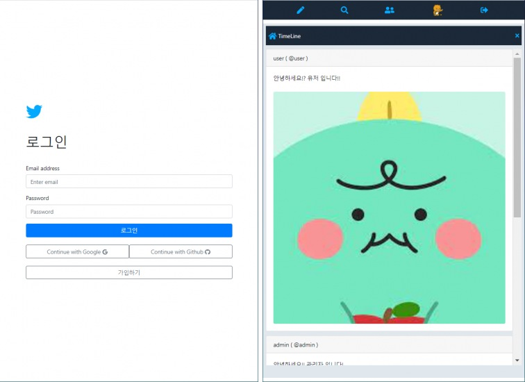
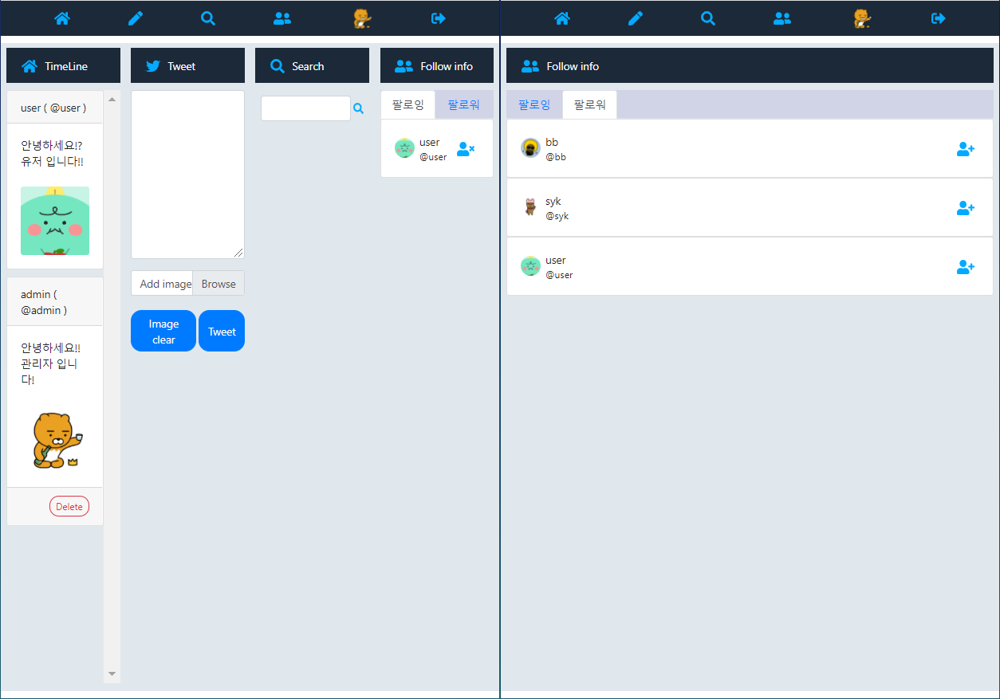
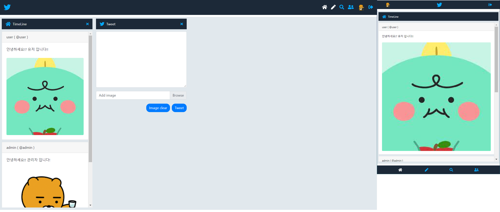

# React + Firebase를 사용한 sns 개발.
- 0406 : 사용자 가입 완료.
- 0407 : 트윗 CRUD 기능 완료.
- 0408 : 사진 첨부 및 프로필 업데이트 기능
- 0409 : 임시 완성
- 0410 : bootstrap 활용하여 디자인 변경
- 0411 : 로그인 화면 및 메인 레이아웃 디자인

- 0412 : 프로필 수정, 트윗 조회, 트윗 작성, 트윗 삭제 완료

- 0413 : 기존 - 사용자 정보 component 마다 prop으로 전달
- 0413 : 변경 - 사용자 정보 redux 방식으로 변경
- 0414 : reducer 분할, search layout 처리, userObj 처리 방법 함수화.
- 0415 : 유저 search 완료 

- 0416 : 유저 follow 기능 추가, 검색한 유저가 본인이거나 이미 팔로우한 사용자라면 팔로우 버튼 숨김 처리
- 0417 : 내가 팔로잉 중인 유저, 나를 팔로우 하는 유저 기능 개발 

- 0418 : 기존 팔로우, 언팔로우 시 새로고침하기 전에 view가 바뀌지 않는 현상 수정
- 0421 : 로그인 및 메인 화면 헤더, timeline 반응형 css 적용, conponent의 show hide 처리 reducer 통합

- 0422 : 반응형 css를 적용했지만 기존에는 컴포넌트들을 여러 개 show 했을 떄 크기만 작아지는 현상을 화면 크기가 줄어들면 작아진 화면에 맞게 각 컴포넌트 하나씩만 보여지도록 처리 작아진 화면에서는  close 아이콘을 통하여 컴포넌트를 hide 시키지 않고 헤더의 아이콘을 클릭하여 컴포넌트 이동

- 0423 : webpack + babel 적용
- 0424 : 리렌더링 시 불필요하게 함수가 새로 생성되는 걸 막기 위해 useCallback형태로 변경
- 0430 : 기존 css를 scss로 변경하여 적용
- 0503 : 현재 활성화 된 목록은 header 아이콘 색 다르게 변경, 화면 사이즈 작아질 때 footer가 보여지도록 변경, 각 메뉴 show, hide시 transition 적용

- 0510 : 불필요한 re-rendering을 막기 위해 컴포넌트에 React.memo 적용