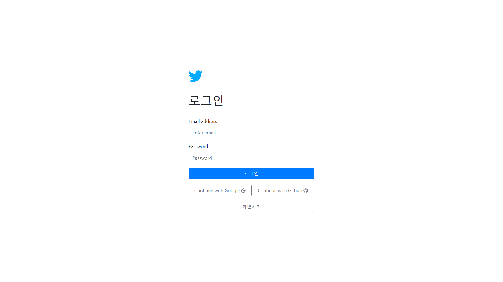
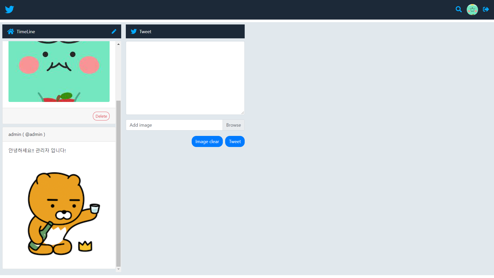
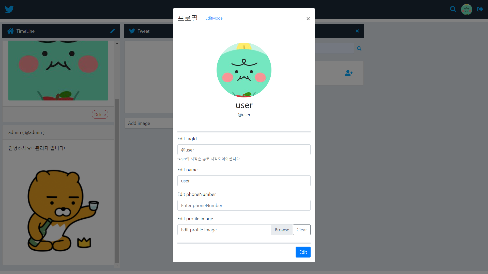
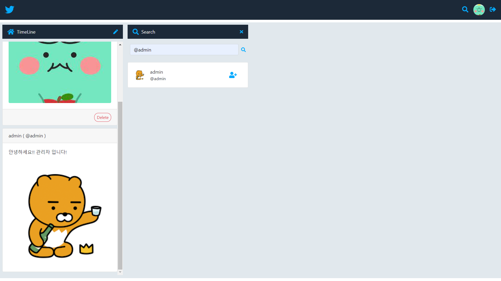
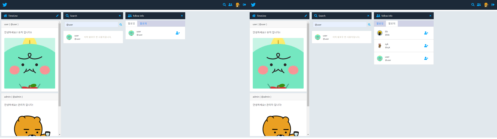
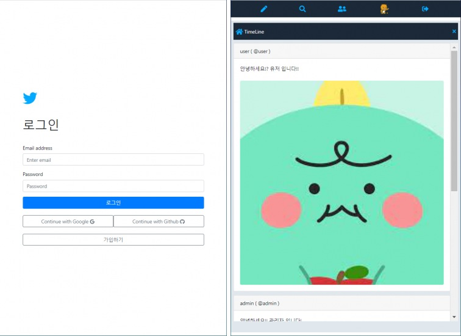

# React + Firebase를 사용한 sns 개발.
0406 - 사용자 가입 완료.
0407 - 트윗 CRUD 기능 완료.
0408 - 사진 첨부 및 프로필 업데이트 기능
0409 - 임시 완성
0410 - bootstrap 활용하여 디자인 변경
# 0411 - 로그인 화면 및 메인 레이아웃 디자인
<>
# 0412 - 프로필 수정, 트윗 조회, 트윗 작성, 트윗 삭제 완료
<>
<>
# 0413 - 기존 - 사용자 정보 component 마다 prop으로 전달
# 0413 - 변경 - 사용자 정보 redux 방식으로 변경
# 0414 - reducer 분할, search layout 처리, userObj 처리 방법 함수화.
# 0415 - 유저 search 완료 
<>
# 0416 - 유저 follow 기능 추가, 검색한 유저가 본인이거나 이미 팔로우한 사용자라면 팔로우 버튼 숨김 처리
# 0417 - 내가 팔로잉 중인 유저, 나를 팔로우 하는 유저 기능 개발 
<>
# 0418 - 기존 팔로우, 언팔로우 시 새로고침하기 전에 view가 바뀌지 않는 현상 수정
# 0421 - 로그인 및 메인 화면 헤더, timeline 반응형 css 적용, conponent의 show hide 처리 reducer 통합
<>
